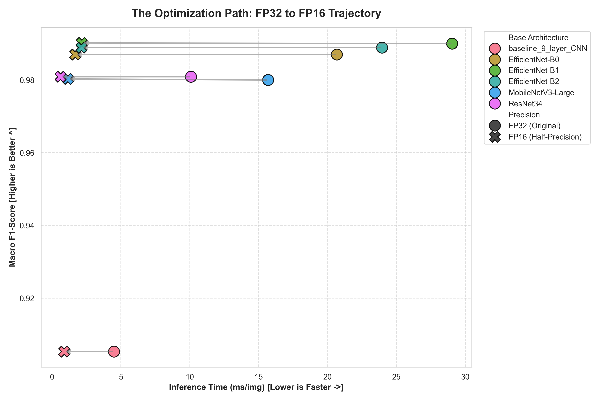
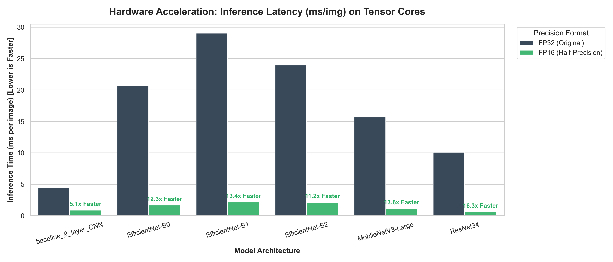

# 🌱 PlantVillage Pathology Benchmarking & Edge Optimization Pipeline

An end-to-end, academically rigorous machine learning pipeline designed to classify agricultural leaf diseases across 39 classes using the PlantVillage dataset.

This project moves beyond standard accuracy metrics by systematically profiling state-of-the-art Transfer Learning architectures, executing **FP16 Tensor Core Optimization** for hardware acceleration, and utilizing Explainable AI (Grad-CAM) to prove model interpretability.

---

## 🏆 Key Deployment Findings: The "Free Lunch" of FP16

The crowning achievement of this pipeline is the empirical proof of hardware-accelerated model compression. By converting our 32-bit floating-point (FP32) models to 16-bit half-precision (FP16) on dedicated Tensor Cores, we achieved:

1. **Zero Accuracy Degradation:** Macro F1-Scores remained perfectly identical down to the decimal.
2. **Massive Latency Acceleration:** Processing speeds increased by up to **13.6x** faster per image.
3. **50% Memory Compression:** VRAM and disk footprint were universally cut in half.

### 🌟 The Ultimate Winner: `EfficientNet-B1 (FP16)`

For real-world agricultural deployment (e.g., drone scanning or edge APIs), **EfficientNet-B1 (FP16)** is the definitive champion. It achieves a near-perfect **0.990 Macro F1-Score** while processing an image in just **2.16 ms** with a highly manageable **12.8 MB** footprint.


> *Figure 1: The Optimization Trajectory. Notice how shifting models from FP32 to FP16 pushes them horizontally to the left (faster inference) without dropping vertically (zero accuracy loss).*

## ⚙️ Pipeline Architecture

The codebase is structured sequentially to ensure idempotency and reproducibility:

### 1. Data Engineering & Leak-Proofing

* **Strict Quarantine:** An 80/20 train/validation physical directory split *before* any processing.
* **Hybrid Balancing Engine:** Cures the "Accuracy Paradox" of imbalanced datasets by programmatically downsampling majority classes and augmenting minority classes (via OpenCV) to achieve a uniform training distribution of exactly 800 images per class.

### 2. Transfer Learning Engine

* Freezes base ImageNet weights of standard architectures, dynamically swaps the classification head for 39 disease classes, and fine-tunes the top ~20% of the network.

### 3. Post-Training Evaluation (FP32)

* Aggregates all validation predictions to calculate strictly **Macro-Averaged** Precision, Recall, and F1-Scores to prevent majority-class bias.

### 4. Tensor Core Optimization (FP16)

* Converts all `.pth` weights to half-precision and utilizes PyTorch's `torch.autocast` and `torch.cuda.Event` to measure hardware-synchronized, millisecond-accurate inference latency directly on the GPU.

---

## 🧠 Model Zoo & Architecture Dashboards

This pipeline evaluates the mathematical trade-offs of 6 distinct vision architectures:

1. **Custom 9-Layer CNN** (Control Baseline)
2. **EfficientNet-B0** (Compound Scaling Baseline | $224 \times 224$)
3. **EfficientNet-B1** (Scaled Resolution/Depth | $240 \times 240$)
4. **EfficientNet-B2** (Scaled Resolution/Depth | $260 \times 260$)
5. **MobileNetV3-Large** (Hardware-Aware NAS edge-optimization | $224 \times 224$)
6. **ResNet34** (Legacy Residual Paradigm | $224 \times 224$)


> *Figure 2: Holistic Trade-off Radar Charts. The FP16 (Green) perfectly overlaps the FP32 (Blue) on predictive metrics, while massively ballooning outward on computational efficiency.*

### Hardware Acceleration Profiles



---

## 🔬 Explainable AI (Grad-CAM)

To combat the "Clever Hans" effect (where a model learns background artifacts instead of actual diseases), this pipeline features an automated batch-auditing XAI script.

It hooks into the final convolutional layer of the trained networks to visualize the gradient impact of spatial features, projecting a heatmap onto the original leaf image to prove the model is analyzing true necrotic tissue and fungal lesions.

.JPG)

---

## 💻 Hardware & Environment

This pipeline was strictly engineered and profiled for the **NVIDIA RTX 5000** architecture.

* `torch.backends.cudnn.benchmark = True` is enabled to automatically select the most optimal C++ convolution algorithms.
* FP16 conversions rely on native hardware Tensor Cores for acceleration.

**Dependencies:**

```bash
pip install torch torchvision torchsummary opencv-python numpy pandas matplotlib seaborn grad-cam scikit-learn
```

---

## 📁 Repository Structure

```text
PlantVillage_Project/
│
├── trained_models/                  # Serialized FP32 weight files
├── fp16_models/                     # Optimized Half-Precision weights
│
├── gradcam_outputs/                 # Explainable AI diagnostic plots
│
│
├── AIDL_Group_project.ipynb         # Full Code Notebook with Explanations
├── PostTraining_Macro_Benchmarks.csv # Original FP32 Master Report
├── FP16_GPU_Benchmarks.csv           # Optimized FP16 Master Report
│
└── *.png                            # Generated Visualization Dashboards

```
